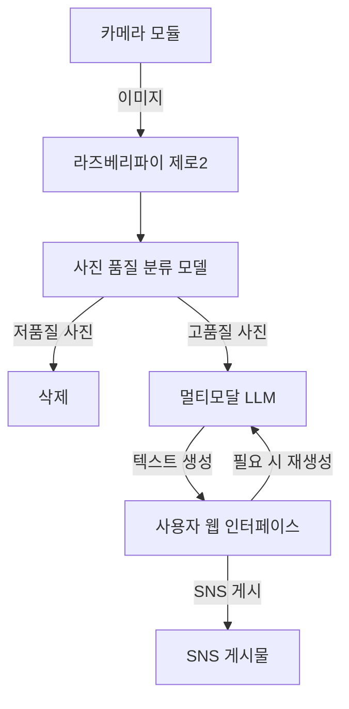

# 일상 기록 미니 AI SNS 카메라

## 개요

라즈베리 파이 제로와 CSI-2 연결 카메라를 사용하여 일정 시간 간격으로 사진을 촬영하고, CNN을 사용하여 좋은 품질의 사진을 필터링한 후, 멀티모달 LLM을 이용해 SNS 게시글을 자동으로 생성하고 게시

## 주요 기능

1. **사진 촬영**
   - 라즈베리 파이 제로에 연결된 카메라모듈로 일정 간격으로 사진 촬영
   - 촬영된 사진은 저장되고 (서버 or 사진 품질 분류 모델) 로 전송됨

2. **이미지 필터링**
   - 촬영된 사진을 CNN 모델로 분류하여 품질이 좋은 사진만 선별해 LLM서버로 업로드
   - 저품질 사진과 잘 나온 SNS 사진을 학습하여 구분 모델을 만들 계획

3. **텍스트 생성**
   - 필터링된 사진을 멀티모달 LLM (koLLaVA, gemini vision, GPT-4v 등)으로 전송하여 사진에 맞는 SNS 게시글을 자동 작성
   - 웹 사용자 인터페이스를 만들어 글에 담아낼 감정 (긍정, 부정, 미입력), 또는 키워드, GPS 위치를 입력하여 상황에 어울리는 게시글로 수동 구성
   - 사진의 내용과 특징을 반영하여 멀티모달 LLM을 활용한 글을 생성

4. **SNS 게시**
   - 생성된 텍스트를 SNS API 또는 공유 기능을 통해 자동 또는 수동으로 게시
   - 트위터 API를 사용하여 트윗을 작성 또는 인스타그램 API를 사용하여 게시물 업로드

## 구조

